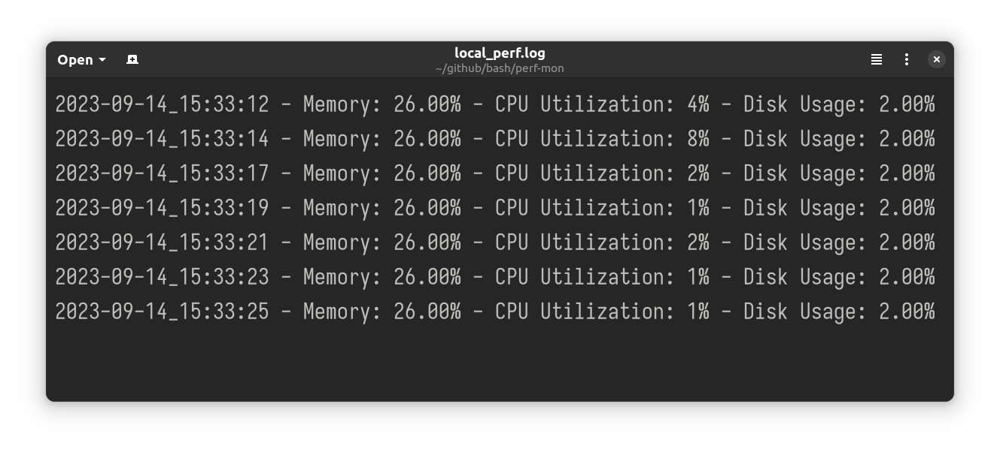

# perf-mon
## What does this do?

Monitor System Performance and Generate Logs.

## What do the logs look like?


## How do i use it?
1. Place the file with the extension .sh in your path.
2. Make it executable:
```shell
$ chmod +x local_mon.sh
```

3. Restart your shell and use the following command:
```shell
$ local_mon
```

## Dependencies:
- sed
- awk
- bc
- mpstat from sysstat
